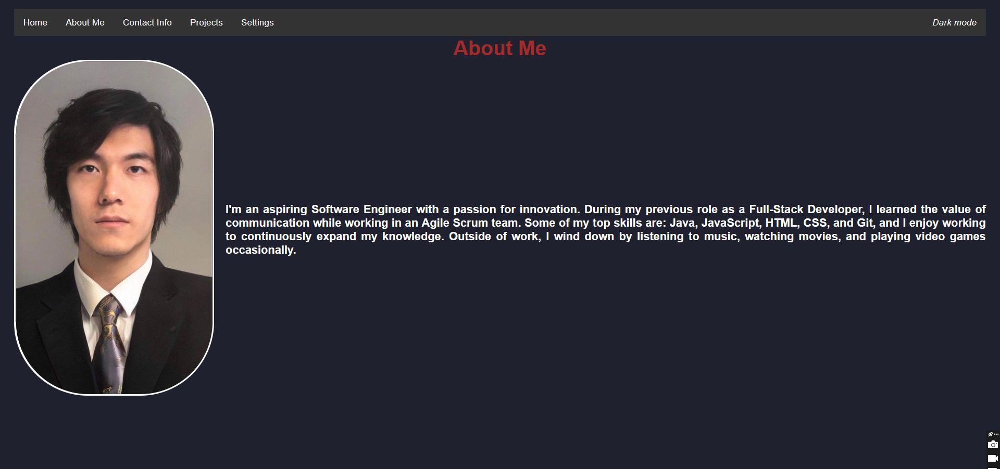
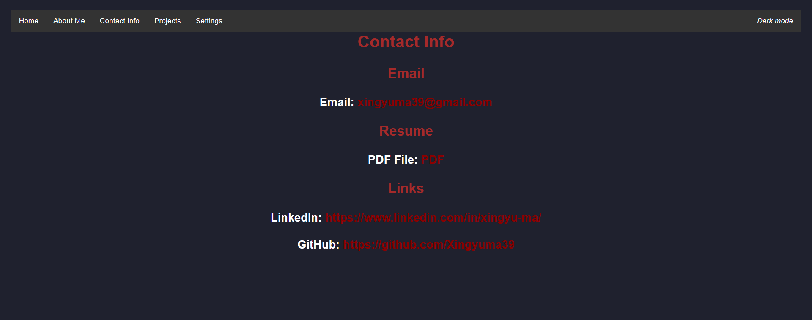
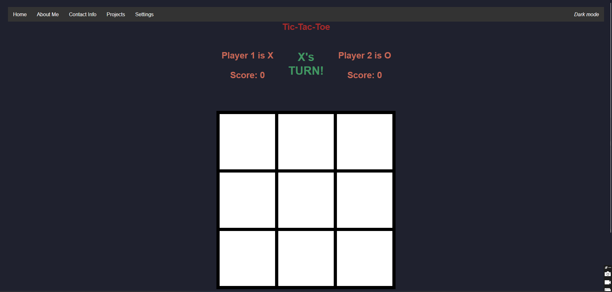

# Portfolio
### Home Page

## List of Technologies Used
- JavaScript
- HTML
- CSS

## Installation Instructions
- None

## User Stories
- As a user of the website, I want to read Jason's bio and play the games that he makes, so that I can enjoy and/or leave suggestions for updating the webpage.
- As a recruiter, I want to get a feel for Jason's coding and UX/UI skills, so that I can gauge his abilities.

## Screenshots
### About Me Page

#### This page features a brief description about Xing Yu, including his skills and hobbies.

### Contact Info

#### This page features Xing Yu's contact info and links.

### Tic Tac Toe

#### This page features one of Xing Yu's projects, Tic Tac Toe. Connect 3 to win! After each game, the player can press the "Play Again!" button to initiate a new round, or reset the score by pressing the "Reset Score" button.

## Unsolved Problems
- Minor CSS issues with text in Tic Tac Toe game
- CSS issues with portrait on Home Page & About Me Page

## Next Steps
- Continually add more styling using CSS to improve UX/UI
- Gradually add more mini-games and projects
- Add content for settings page
- Add content for project concepts page

